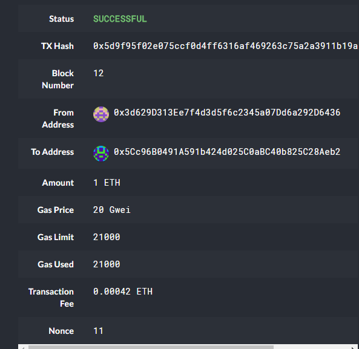

# Blockchain 

## Method

By using Hd-Wallet, we are able to send and recieve eth and btctest to different accounts. The HD-Wwallet allows individuals to use its functionality to test transactions. Utilizing the BTCTEST and ETH through wallet.py, we are able to produce transactional hashs.

## Transactions

